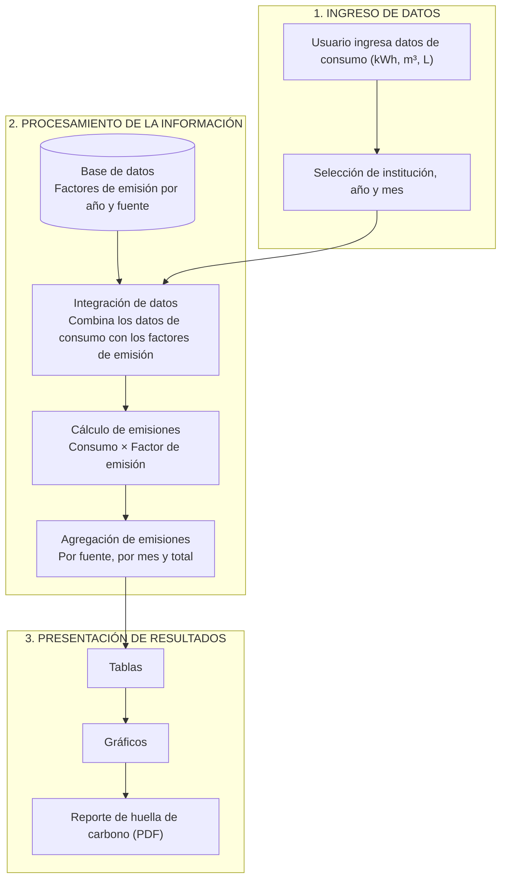

# Carbon Track: metodología

Contexto para Claude sobre cómo funciona la app de huella de carbono. Basado en el informe de la cátedra Tratamiento de Efluentes Gaseosos (Tecnología Ambiental, UNICEN, 2026) por Stefania Gil.

## Resumen

Aplicación web que estima la huella de carbono de una institución a partir de sus consumos de electricidad, gas natural y combustibles líquidos, y expresa el resultado en CO₂e. Usa factores de emisión oficiales adaptados a Argentina, guardados en la base de datos y diferenciados por año. Pensada para estudiantes, profesores, instituciones educativas, sin instalación. Aplicable a instituciones educativas y, a futuro, a hospitales, municipios y empresas que tengan registros de consumo.

## Flujo de la aplicación



## Etapa 1: ingreso de datos

El usuario selecciona institución, año y mes, y carga los consumos con una plantilla estándar. Columnas del archivo:

| Columna | Unidad |
|---|---|
| Año | n/a |
| Mes | n/a |
| Electricidad | kWh |
| Gas natural | m³ |
| Combustibles líquidos (gasoil y nafta por separado) | litros |

Las unidades coinciden con las de las facturas de servicios, lo que simplifica la carga. Gasoil y nafta se separan porque tienen factores distintos.

## Etapa 2: procesamiento

Se aplica el método de factores de emisión, de forma desagregada por fuente, mes e institución:

```
Emisiones (kg CO₂e) = Dato de actividad × Factor de emisión        (Ec. 1)

E_total = Σ_i ( Consumo_i × FE_i )                                  (Ec. 2)
```

- i recorre cada combinación de fuente y mes.
- Para cada registro, la app recupera de la base de datos el factor que corresponde a la fuente y al año, y lo multiplica por el dato de actividad.
- Las emisiones totales del período son la suma de todas las fuentes y meses.
- Este enfoque modular permite descomponer el resultado y ver el aporte de cada fuente y su distribución temporal.
- Cuando intervienen varios gases, cada uno se pondera por su potencial de calentamiento global (GWP), por lo que el factor ya viene expresado en CO₂e.

## Etapa 3: presentación

Tablas, gráficos y reporte exportable en PDF, con emisiones por fuente, por mes y total del período seleccionado.

## Decisiones de diseño

- **Factores en la base de datos:** el usuario nunca ingresa ni ve factores, solo consumos.
- **Factores por año:** el factor eléctrico cambia cada año, por lo que se guarda un valor por año y se permiten cálculos históricos precisos en lugar de un promedio único.
- **Motor desacoplado de los factores:** se pueden actualizar de forma centralizada (por ejemplo, al publicarse el factor eléctrico de un año nuevo) sin tocar la lógica ni requerir acción de las instituciones.
- **Multi-institución.**
- **Detección automática** de períodos y aplicación del factor según fuente y año.

## Fuentes y alcances (GHG Protocol)

| Fuente | Alcance | Variable | Unidad |
|---|---|---|---|
| Electricidad | Alcance 2 | Consumo eléctrico mensual | kWh |
| Gas natural | Alcance 1 | Consumo de gas mensual | m³ |
| Gasoil | Alcance 1 | Volumen consumido | litros |
| Nafta | Alcance 1 | Volumen consumido | litros |

Fuera de alcance por ahora: Alcance 3 (transporte de personas, residuos, compras, papel).

## Factores de emisión reales de ejemplo para guardar en la DB, y borrar los que estan que eran temporales

| Fuente | Factor | Unidad | Referencia |
|---|---|---|---|
| Electricidad 2019 | 0,428 | kg CO₂/kWh | Secretaría de Energía (Margen de Operación Simple) |
| Electricidad 2020 | 0,443 | kg CO₂/kWh | Secretaría de Energía (MOS) |
| Electricidad 2021 | 0,459 | kg CO₂/kWh | Secretaría de Energía (MOS) |
| Electricidad 2022 | 0,450 | kg CO₂/kWh | Secretaría de Energía (MOS) |
| Electricidad 2023 | 0,429 | kg CO₂/kWh | Secretaría de Energía (MOS) |
| Gas natural | 2,19 | kg CO₂e/m³ | IPCC 2006, combustión estacionaria |
| Gasoil (diésel) | 2,70 | kg CO₂/L | US EPA Emission Factors Hub 2025 |
| Nafta (95 oct.) | 2,32 | kg CO₂/L | US EPA Emission Factors Hub 2025 |

Criterios de selección:

- **Electricidad:** factor oficial de la Secretaría de Energía de la Nación, método de Margen de Operación Simple de Naciones Unidas con datos de CAMMESA. Un valor por año, disponibles 2006-2023 en la base, con actualización y un rezago de unos dos años.
- **Gas natural:** valor por defecto del IPCC. Argentina no tiene un factor nacional oficial para gas natural, así que se usa el de referencia internacional para inventarios en ausencia de datos del país.
- **Combustibles líquidos:** EPA Emission Factors Hub 2025.
- Gas y combustibles son constantes en el tiempo (dependen de las propiedades fisicoquímicas del combustible, no de la matriz energética). Solo el factor eléctrico varía por año.

**faltan agregar todos los factores de emision a disposicion (podemos agregarlo a algunas de las tareas)

### Por qué Margen de Operación y no IEA

- **Margen de Operación (elegido):** el denominador incluye solo generación térmica, porque la demanda adicional de una institución la cubre una central térmica y no fuentes renovables o nucleares que ya operan a máxima capacidad (bajo costo y despacho prioritario). Es más representativo de un sistema argentino que depende de centrales térmicas a gas para la demanda variable.

## Limitaciones metodológicas

- Solo Alcances 1 y 2.
- El factor eléctrico es un valor anual único y no refleja la variabilidad intraanual de la matriz (hidrología, viento, radiación solar, paradas nucleares).
- Los resultados son estimaciones de orden de magnitud, no mediciones exactas.

## Trabajo futuro

- Incorporar Alcance 3.
- Adaptar la app a otras organizaciones (hospitales, municipios, empresas).

## Referencias clave

- IPCC, 2006 IPCC Guidelines for National Greenhouse Gas Inventories, Vol. 2, Cap. 2.
- Secretaría de Energía de la Nación, factor de emisión de CO₂ de la red eléctrica argentina (datos.gob.ar).
- US EPA, Emission Factors for Greenhouse Gas Inventories, 2025.
- WRI y WBCSD, The Greenhouse Gas Protocol: Corporate Standard.
- UNFCCC, CDM Tool 07, Tool to Calculate the Emission Factor for an Electricity System.
- IEA, Emissions Factors Database Documentation.
